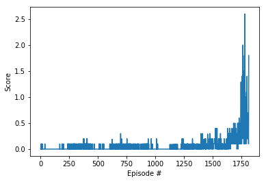
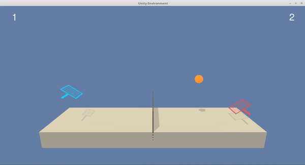

# Solving Tennis Environment with Multi Agent Deep Deterministic Policy Gradients

## Learning Algorithm
 
 Multi Agent Deep Deterministic Policy Gradients (MADDPG) is used in the project because of presense of two agents learning the environment by playing against eachother.
 The implementation can be found in [Solution.ipynb](Solution.ipynb) file. The MADDPG agent uses multiple DDPG agents.
 The DDPG Agent requires an actor (`Actor` class) and a critic (`Critic` class) model.
The actor model learns to predict an action vector while the critic model learns Q values for state-action pairs.
The critic models servers as a baseline for the actor model to act upon.
DDPG uses experience replay to sample batches of uncorrelated experiences to train on. 
It also distinguishes between local and target models for both actor and critic, similar double DQN technique.
Local models are updated by minimizing loses while target models are updated through soft update, 
i.e. local model parameters values are partially transferred to target models. 
This helps to avoid overestimation of Q-values and makes the training more stable
 The learning algorithm of DDPG is as follows:
 
1. A batch of experiences is sampled from the replay buffer.
2. Update local critic model
    1. Predict actions for the next states with the target actor model
    2. Compute Q-values for the next states and actions with the target critic model
    3. Compute target Q-values for the current states and actions using the Bellman equation
    4. Compute Q values for the current states and actions with the local critic model
    5. Use the target and local Q-values to compute the loss
    6. Minimize the loss for the local critic model
3. Update online actor model
    1. Predict actions for current states from the local actor model
    2. Compute Q-values with the local critic model
    3. Use the Q-values to compute the loss
    4. Minimize the loss for the local actor model
4. Soft update of the target critic and actor models

The MADDPG agent has a common `Replay Buffer` from which experiences are sampled for each agents. By using common replay buffer actions taken by one agent can affect other.
Thus both the agents learn from the mistakes made by any one agent.

 
## Network architecture

A single DDPG agent uses two network architectures, one for actor and one for critic.
The actor network maps state to action and has the following structure:
 
1. State input (24 units)
2. Hidden layer (512 units) with ReLU activation 
3. Hidden layer (256 units) with ReLU activation 
4. Action output (2 units) with tanh activation

The critic network maps state and action to Q value and has the following structure:
1. State input (24 units)
2. Hidden layer (512 units) with ReLU activation 
3. Hidden layer (256 units) with ReLU activation 
4. Q-value output (1 node)

## Hyperparameters

| Hyperparameter | Value | Description |
|---|---:|---|
| Replay buffer size | 1e5 | Maximum size of experience replay buffer |
| Replay batch size | 256 | Number of experiences sampled in one batch |
| Actor hidden units | 512, 256 | Number of units in hidden layers of the actor model |
| critic hidden units | 512, 256 | Number of units in hidden layers of the critic model |
| learning rate | 1e-4 | Controls parameters update of the online model |
| Target update mix | 1e-3 | Controls parameters update of the target actor and critic models |
| GAMMA | 0.99 | discount factor |
| Max episodes | 5000 | Maximum number of episodes to train |


## Results

The agent was able to solve the environment by achieving score above 0.5 over 100 consecutive episodes after 1814 episodes.


Plot of the scores:



```
Episode 100	Average score: 0.007
Episode 200	Average score: 0.005
Episode 300	Average score: 0.026
Episode 400	Average score: 0.052
Episode 500	Average score: 0.023
Episode 600	Average score: 0.007
Episode 700	Average score: 0.034
Episode 800	Average score: 0.034
Episode 900	Average score: 0.016
Episode 1000	Average score: 0.024
Episode 1100	Average score: 0.006
Episode 1200	Average score: 0.015
Episode 1300	Average score: 0.040
Episode 1400	Average score: 0.048
Episode 1500	Average score: 0.084
Episode 1600	Average score: 0.100
Episode 1700	Average score: 0.140
Episode 1800	Average score: 0.448
Solved in episode: 1814 	Average score: 0.506
```
## Trained agent:

After training the agent to meet the reqirements of the environment, this is what it looks like



## Future work


1. Optimization of hyper parameters to solve the environent in fewer steps.
2. Implementing other Actor-Critic methods like A2C, A3C, and GAE methods and compare to find which algorithm is effective in this environment.
3. Implementing Alpha go algorithm 


